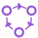
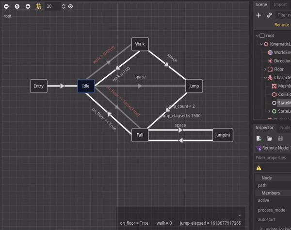
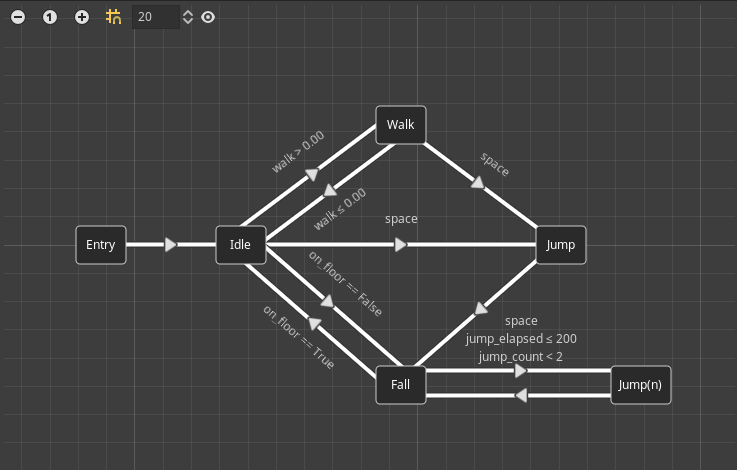
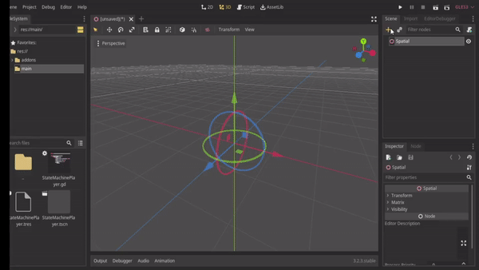
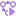
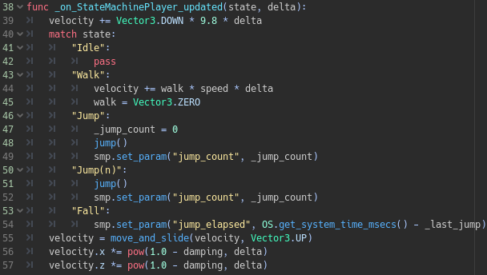

# gd-YAFSM (**g**o**d**ot-**Y**et **A**nother **F**inite **S**tate **M**achine)

Designer-friendly Finite State Machine implemented in "Godotic" way

⚠️ **Warning**
> It is not recommended to be used in production yet, as api might be changed before v1.0.
> Testing & reporting bugs are greatly appreciated.

## Content

- [Feature](#feature)
- [Installation](#installation)
- [Getting Started](#getting-started)
  - [Editor](#editor)
  - [Code](#code)
- [Nested FSM](#nested-fsm)
  - [State](#state)
  - [Parameter](#parameter)
- [Debug](#debug)
- [Demo](https://github.com/imjp94/gd-yafsm-demo)
- [Documentation](addons/imjp94.yafsm/README.md)

## Feature

- Designer-friendly

  
  > Design `StateMachine` in a flowchart-like editor
- Remote Debug

  
  > Visualize flow of `StateMachine` & inspect parameters in realtime
- Self-explanatory

  
  > Visualize game/UI state from flowchart
- Zero learning curve
  > Similar workflow as using `AnimationTree`, and not required to inherit any custom class, just plug and play
- Nested FSM
  > Nested Finite State Machine workflow supported to create complex state machine with ease
- Reusability
  > As a `Resource`, `StateMachine` can be used repeatedly in different scenarios(`StateMachinePlayer`) and provide different outcome based on the input.
- Minimal
  > Compact data structure for `StateMachine` resource file

For more detail, see [CHANGELOG.md](CHANGELOG.md)

## Installation

1. Install directly from Godot Asset Library

or

1. Download this respository, move `addons/imjp94.yafsm` to your `{project_dir}`

2. Enable it from Project -> Settings -> Plugins

## Getting Started

### Editor



1. Add `StateMachinePlayer` node from "Create New Node" window.

2. Select created node and the state machine editor should shows up.

3. Click on "Create StateMachine" button to get started.

Finally, `Right-Click` on graph to add state node and `Shift + Drag` on node to start connect(`Shift + Drag` again on line to reconnect)

Special states:

- Entry: Entry point of a `StateMachine`, always required
- Exit: `State` that break the flow of `StateMachine`, unless restarted with `StateMachinePlayer.restart()`, mainly used in nested-`StateMachine`.

### Code

After setup `StateMachine` with editor, you can connect to the following signals from a `StateMachinePlayer`:

- `transited(from, to)`: Transition of state
- `updated(state, delta)`: Time to update(defined by `process_mode`), up to user to handle anything, for example, update movement of `KinematicBody`


*Example code snippet of KinematicBody connect "updated" signal*

And control `StateMachinePlayer` by accessing parameter:

```gdscript
var smp = get_node("StateMachinePlayer")
smp.set_trigger("jump")
smp.set_param("jump_count", 1)
smp.get_param("on_floor", false)
smp.has_param("velocity")
```

That's it!

For most of the case, you don't have to inherit from any custom class by this plugin, simply just connect signals to your existing node and you're good to go.

> See [documentation](addons/imjp94.yafsm/README.md) for more details

## Nested FSM

The only different between nested/normal FSM is how state/parameters are accessed.

### State

- normal state - "State"
- nested state - "BaseState/AnotherState/EndState"

```gdscript
var normal_state = "Idle"
var nested_state = "App/Game/Play" # EndState can be Entry/Exit
```

`StateDirectory` class is provided to traverse state path like file directory:

```gdscript
const StateDirectory = preload("addons/imjp94.yafsm/src/StateDirectory.gd")

# Handle "transited" signal
func _on_normal_state_transited(from, to):
	match to:
		"Entry":
			print("Enter")
		"Game":
			print("Game")
		"Exit":
			print("Exit")

# Handle "transited" signal
func _on_nested_state_transited(from, to):
	var to_dir = StateDirectory.new(to)

	match to_dir.next(): # Initial next() required to move to base state
		"Entry":
			print("Enter")
		"Game":
			match to_dir.next(): # It can be called recursively, until return null
				"Entry":
					print("Game Enter") # Game/Entry
		"Exit":
			print("Exit")
```

### Parameter

Behind the scene, `StateMachinePlayer` always differentiate parameters into 2 types: global & local

- global parameter
  - Just a normal parameter - "param_name"
  - Never erased automatically, unless `erase_param`/`clear_param` called by user
- local parameter 
  - Parameter that local to nested state - "BaseState/TargetState/param_name"
  - Erased upon Exit, for example, "App/Game/Exit" will cause all local parameter("App/Game/{param_name}") to be erased

```gdscript
var smp = get_node("StateMachinePlayer")
var global_param = smp.get_param("state")
var local_param = smp.get_param("App/Game/playing")
local_param = smp.get_nested_param("App/Game", "playing")
smp.set_param("App/Game/End/victory", true)
smp.set_nested_param("App/Game", "paused", true)
```

Besides of controlling `StateMachinePlayer`, it's useful to set arbitrary value with `set_param`

```gdscript
var smp = get_node("StateMachinePlayer")
smp.set_param("game", preload("game.scn"))
var game_scn = smp.get_param("game")
```

### Debug

- Editor
  > When playing scene, select `StateMachinePlayer` node in remote scene tree to view flow of `StateMachine` in realtime
- In-game
  > Add `res://addons/imjp94.yafsm/src/debugger/StackPlayerDebugger.tscn` to `StackPlayer`(so as `StateMachinePlayer`) to visualize the stack on screen.
  
## Demo

Check out [gd-YAFSM-demo](https://github.com/imjp94/gd-yafsm-demo) for how you can integrate gd-YAFSM into you project and manage app state with `StateMachine`

## Documentation

Refer to [Documentation](addons/imjp94.yafsm/README.md) located in addons/imjp94.yafsm/README.md
