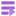
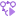
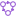

# Documentation

## Classes

All of the class are located in `res://addons/imjp94.yafsm/src` but you can just preload `res://addons/imjp94.yafsm/YAFSM.gd` to import all class available:

```gdscript
const YAFSM = preload("res://addons/imjp94.yafsm/YAFSM.gd")
const StackPlayer = YAFSM.StackPlayer
const StateMachinePlayer = YAFSM.StateMachinePlayer
const StateMachine = YAFSM.StateMachine
const State = YAFSM.State
```

### Node

- [StackPlayer](src/StackPlayer.gd) 
  > Manage stack of item, use push/pop function to set current item on top of stack
  - `current # Current item on top of stack`
  - `stack`
  - signals:
    - `pushed(to) # When item pushed to stack`
    - `popped(from) # When item popped from stack`
- [StateMachinePlayer](src/StateMachinePlayer.gd)(extends StackPlayer) 
  > Manage state based on `StateMachine` and parameters inputted
  - `state_machine # StateMachine being played`
  - `active # Activeness of player`
  - `autostart # Automatically enter Entry state on ready if true`
  - `process_mode # ProcessMode of player`
  - signals:
    - `transited(from, to) # Transition of state`
    - `entered(to) # Entry of state machine(including nested), empty string equals to root`
    - `exited(from) # Exit of state machine(including nested, empty string equals to root`
    - `updated(state, delta) # Time to update(based on process_mode), up to user to handle any logic, for example, update movement of KinematicBody`

### Control

- [StackPlayerDebugger](src/debugger/StackPlayerDebugger.gd)
  > Visualize stack of parent StackPlayer on screen

### Reference

- [StateDirectory](src/StateDirectory.gd)
  > Convert state path to directory object for traversal, mainly used for nested state

### Resource

Relationship between all `Resource`s can be best represented as below:

```gdscript
var state_machine = state_machine_player.state_machine
var state = state_machine.states[state_name] # keyed by state name
var transition = state_machine.transitions[from][to] # keyed by state name transition from/to
var condition = transition.conditions[condition_name] # keyed by condition name
```

> For normal usage, you really don't have to access any `Resource` during runtime as they only store static data that describe the state machine, accessing `StackPlayer`/`StateMachinePlayer` alone should be sufficient.

- [State](src/states/State.gd)
  > Resource that represent a state
  - `name`
- [StateMachine](src/states/StateMachine.gd)(`extends State`) 
  > `StateMachine` is also a `State`, but mainly used as container of `State`s and `Transitions`s
  - `states`
  - `transitions`
- [Transition](src/transitions/Transition.gd)
  > Describing connection from one state to another, all conditions must be fulfilled to transit to next state
  - `from`
  - `to`
  - `conditions`
- [Condition](src/conditions/Condition.gd)
  > Empty condition with just a name, treated as trigger
  - `name`
- [ValueCondition](src/conditions/ValueCondition.gd)(`extends Condition`)
  > Condition with value, fulfilled by comparing values based on comparation
  - `comparation`
  - `value`
- [BooleanCondition](src/conditions/BooleanCondition.gd)(`extends ValueCondition`)
- [IntegerCondition](src/conditions/IntegerCondition.gd)(`extends ValueCondition`)
- [FloatCondition](src/conditions/FloatCondition.gd)(`extends ValueCondition`)
- [StringCondition](src/conditions/StringCondition.gd)(`extends ValueCondition`)
